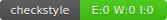

# UCE Génie Logiciel Avancé : Techniques de tests

## Introduction

Vous allez à travers ces projet mettre en application une partie des aspects évoqués en cours vis à vis des techniques de tests.  
Pour cela nous allons réaliser un projet logiciel de petite taille, en suivant la roadmap suivante : 
- Setup du projet
- Mise en place des outils d’intégration continue
- Écriture des tests unitaires
- Écriture des mocks, et validation des tests
- Développement dirigé par les tests
- Documentation et conventions de style
- Test d'une implémentation donnée

Durant cette série de TPs, le gestionnaire de version Git sera utilisé à foison, à travers la plateforme GitHub. Si vous n’êtes pas à l’aise avec cet outil[^1], [voici](http://rogerdudler.github.io/git-guide/) un petit guide à garder sous la main.

## Sujets

L'ensemble des sujets de TPs peut être trouvé dans le dossier `TPs`.

Le dossier `src` contient la définition de l'ensemble des interfaces qui seront l'objet de vos travaux.

## Rendus

Le rendu des TPs se fait au rythme suivant :

- TP1 : 2ème séance
- TP2 : 2ème séance
- TP3 : 3ème séance
- TP4 : 5ème séance
- TP5 : dernière séance
- TP6 : dernière séance

Pour chaque rendu vous devez créer un tag à partir du commit qui correspond à la complétion du TP.  
Si vous ne spécifiez pas de tag, le dernier commit à la date-heure de la fin de séance sera celui considéré.

[^1]: Si vous n’êtes vraiment pas à l’aise avec cet outil nous vous conseillons quand même vivement de vous y mettre.

Le lien vers la javadoc : target/site/testapidocs/index.html

Les différents problèmes que la class RocketPokemonFactory peut rencontrer sont les suivants :
Utilisation inefficace de Random : Dans la méthode generateRandomStat(), un nouvel objet Random est créé à chaque itération de la boucle. Cela peut entraîner une utilisation inefficace des ressources. Il serait préférable de créer une seule instance de Random et de l'utiliser tout au long de la boucle.
Division par zéro potentielle : Dans la méthode generateRandomStat(), si le total est 0, une exception ArithmeticException sera levée en raison de la division par zéro. Il serait préférable de vérifier si le total est zéro avant de faire la division.
Gestion des indices de Pokémon non mappés : Dans la méthode createPokemon(), si l'indice du Pokémon n'est pas dans la carte index2name, le nom du Pokémon est défini sur "MISSINGNO". Cela pourrait ne pas être le comportement souhaité. Il serait préférable de gérer ce cas d'une manière qui convient à votre application.
Statistiques de Pokémon potentiellement faibles : Dans la méthode createPokemon(), si l'indice du Pokémon est supérieur ou égal à 0, les statistiques d'attaque, de défense et d'endurance sont générées aléatoirement. Cela pourrait entraîner des statistiques très faibles pour certains Pokémon. Il serait préférable de mettre en place une logique pour garantir un certain niveau de statistiques pour chaque Pokémon.

## information de contact
Ferrari adrien
groupe : ILSEN ALT
badge circleCi : 
badge codecove : 
badge checkstyle : 